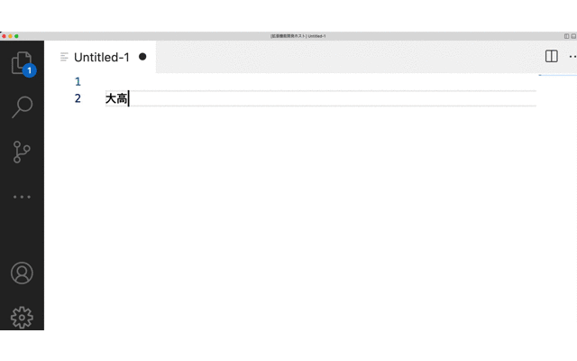

# HI Text Completion

Completion based on HI Text

東京大学史料編纂所が公開する史料集版面ギャラリーのテキストに基づく入力補完を行います。テキストデータの作成にはNDL OCRを使用しています。

## Features

## Release Notes

### 0.0.1

Initial release

### 0.0.2

Add screencast